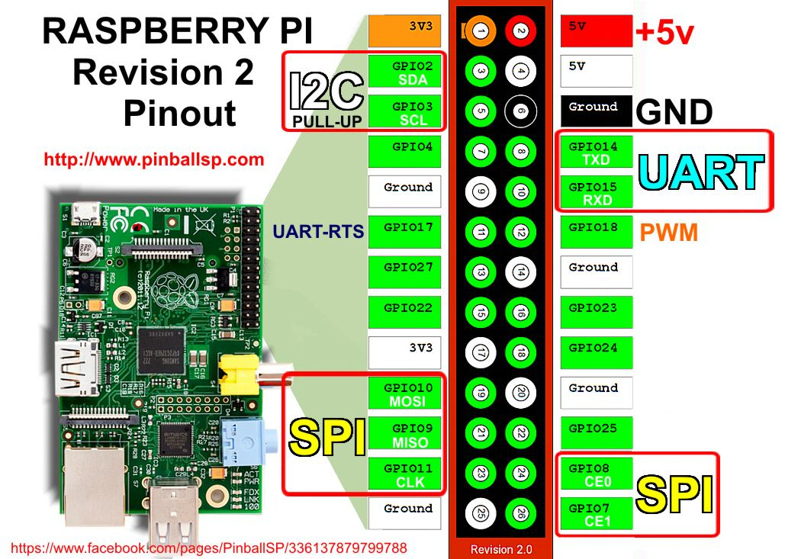

# Itemtracker

A project using an Ultrasonic Sensor connecting to a Servo Motor SG90, in the purpose to followed the movements of an item.
Powered by an arduino MEGA Board, which is plugged to a Raspberry Pi 1B.
The raspberry Pi 1B is used for ...

## Getting sources

Clone the repository and the submodules all in the row :
```
git clone --recurse-submodules https://github.com/Louka013/Itemtracker
```

## Building

Enter repository directory, clean previous build (if needed) and generate image :
```
cd Itemtracker/buildroot
make distclean
make BR2_EXTERNAL=$(realpath ..)/itemtracker itemtracker_defconfig
make
```

## Compilation of a buildroot image for Raspberry Pi 1

- Get Buildroot sources, specifying stable version 2025.02.4:

```
git clone --recurse-submodules https://github.com/buildroot/buildroot -b 2025.02.4
```
- Buildroot configuration by default for raspberry Pi 1:
```
cd buildroot
make -j $(nproc) raspberrypi_defconfig
```
- Compilation of the complete systeme:
```
make -j $(nproc)
```
- Plug SD card;Find it with:
```
sudo fdisk -l
```
- Copie linux image on the SD card:
```
sudo dd if=output/images/sdcard.img of=/dev/<to determine> bs=4M status=progress
```
"to determine" -> "sudo fdisk -l"

## Connecting the Raspberry Pi

We use a TTl 3.3V adaptator.
The usefull Pins are TX, RX and GND.
TX and RX are crossed between raspberry's Pins and TTl 3.3V.




 
## Serial port access from computer

1. Plug FTDI cable on your computer

2. Find tty fitting with FTDI cable

```
sudo dmesg
```
It returns : "FTDI USB Serial Device converter now attached to ttyUSB**x**".

In which **x** is a number.

3. Conect yourself to Raspberry Pi 1B's shell

```
picocom -b 115200 /dev/ttyUSBx
``` 

## Flashing card
```
```
sudo dd if=output/images/sdcard.img of=/dev/<to determine> bs=4M status=progress
```
